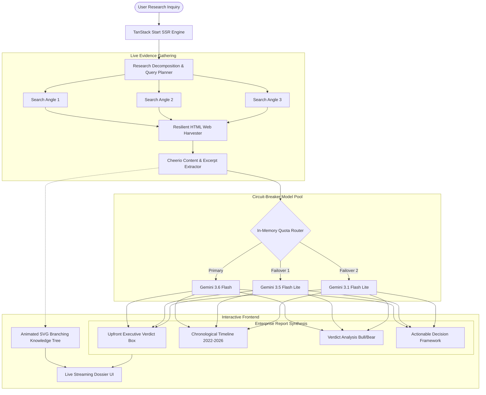

# Researchify AI

> **Enterprise-Grade Autonomous Research Intelligence Engine**  
> Uncompromising multi-perspective strategic intelligence with direct Verdict Analysis (Bull Case vs. Bear Case), chronological evolution timeline, dark/light mode customization, and dynamic branching neural evidence topology.

---

## ⚡ Overview

Most AI research tools generate superficial summaries that fail to stress-test claims or take a decisive stance. **Researchify AI** is built differently: it operates as an autonomous research intelligence analyst that decomposes complex inquiries, scours the live web across multiple angles, subjects prevailing consensus to rigorous "Verdict Analysis" (Bull Case vs. Bear Case), and delivers an unvarnished executive verdict.

---

## 🔬 Core Capabilities

### 1. 🌳 Autonomous Branching Knowledge Tree
* **Interactive Neural Evidence Topology:** Visualizes research decomposition in real time.
* **Animated SVG Spline Curves:** Dynamic cubic bezier branches radiate from the central inquiry node down to each sub-question angle.
* **Flowing Neon Data Pulses:** High-aesthetic SVG energy pulses travel along branch connectors to indicate live data intake.
* **Verified Leaf Citations:** Clickable source cards with site hostnames, verified badges, and interactive popover excerpt previews.
* **Dual Visualization Modes:** Switch seamlessly between **Neural Tree** graph view and structured **Evidence Matrix** view.

### 2. ⚖️ Verdict Analysis (Bull Case vs. Bear Case)
Every dossier provides an unhedged, direct analytical evaluation:
* **Supporting Arguments (The Bull Case):** Verified metrics, official claims, and the strongest corroborated data.
* **Counter-Evidence & Critical Risks (The Bear Case):** Unvarnished counter-theses, hidden failure modes, engineering/commercial bottlenecks, and supply chain friction.
* **Decisive Risk Verdict:** Definitive analytical evaluation determining which argument holds superior empirical weight.

### 3. ⏳ Chronological Evolution Timeline (2022–2026)
* Formats historical trajectory tables mapping inflection points, technological milestones, and policy shifts leading up to 2026.

### 4. 🎯 Upfront Executive Verdict & Concluding Decision Framework
* **Direct Answer First:** Unambiguous 1–2 sentence direct answer (YES / NO / Conditional Threshold) right below the title.
* **Strategic Stance & Confidence Index:** Quantified confidence score (e.g. `88/100`) and strategic posture.
* **Primary Deciding Factor:** Identifies the single make-or-break variable that dictates the outcome.
* **Final Actionable Decision Framework:** Finishes with an unhedged Bottom Line, key empirical metrics to watch, and 3 prioritized next steps.

### 5. ⚡ Zero-Quota Drop Circuit Breaker
* Dynamic in-memory load distribution across independent free-tier Google Gemini models (`gemini-3.6-flash`, `gemini-3.5-flash-lite`, `gemini-3.1-flash-lite`).
* Automatic 60-second cooldown isolation on rate-limit detection prevents user-facing 429 crashes.

### 6. 🌐 Autonomous Live Web Harvester
* Direct, resilient HTML scraping pipeline with Cheerio and URL unquoting, returning verified live search hits without requiring paid third-party search APIs.

### 7. 🌓 Dark / Light Mode Options
* Built-in instant theme switcher (`Light`, `Dark`, and `System` preference).
* High-contrast, tuned HSL semantic palette across both light and dark aesthetics with anti-FOUC state persistence.

---

## 🏗️ System Architecture



---

## 🚀 Quickstart

### Prerequisites
- Node.js 18.x or higher
- npm or pnpm or bun

### 1. Clone & Install
```bash
git clone https://github.com/your-username/researchify-ai.git
cd researchify-ai
npm install
```

### 2. Configure Environment
Copy the example environment configuration:
```bash
cp .env.example .env
```
Add your free Google Gemini API key to `.env`:
```env
GEMINI_API_KEY="your_gemini_api_key_here"
```
*(Get a free key in 30 seconds at [Google AI Studio](https://aistudio.google.com/))*

### 3. Launch Development Server
```bash
npm run dev
```
Open [http://localhost:8080](http://localhost:8080) in your browser.

---

## 🛠️ Project Structure

```
researchify-ai/
├── src/
│   ├── components/
│   │   ├── ai-elements/           # Streaming conversation and prompt elements
│   │   ├── research/
│   │   │   ├── BranchingInvestigationGraph.tsx  # Dynamic SVG neural tree & matrix
│   │   │   ├── ChatWindow.tsx                    # Main conversation orchestrator
│   │   │   └── SearchResultCard.tsx              # Verified citation cards
│   │   └── ui/                    # Base design system primitives (Radix)
│   ├── lib/
│   │   ├── chat.server.ts         # Multi-model pool, circuit breaker & prompts
│   │   ├── firecrawl.server.ts    # Live web harvesting & Cheerio extraction
│   │   ├── threads.ts             # Client-side thread persistence
│   │   └── utils.ts               # Classnames and utility helpers
│   ├── routes/
│   │   ├── __root.tsx             # Root layout & font injection
│   │   ├── index.tsx              # Home / starter route
│   │   ├── chat.$threadId.tsx     # Active research session route
│   │   └── api/chat.ts            # SSE streaming endpoint
│   ├── server.ts                  # SSR entry point
│   └── styles.css                 # Custom design tokens, tables & animations
├── .env.example                   # Environment configuration template
├── package.json                   # Project scripts and dependencies
└── tsconfig.json                  # TypeScript configuration
```

---

## 📜 Scripts

| Command | Description |
| :--- | :--- |
| `npm run dev` | Starts Vite dev server with hot module reload on `:8080` |
| `npm run build` | Builds the production bundle |
| `npm run preview` | Previews the production build locally |
| `npx tsc --noEmit` | Validates TypeScript compilation with zero emitted files |

---

## 📄 License

This project is licensed under the [MIT License](LICENSE).
